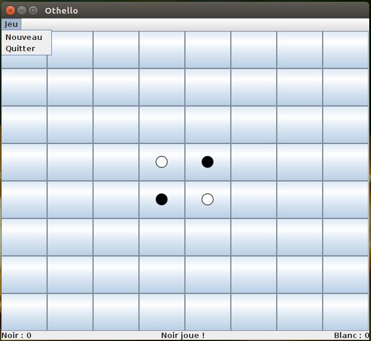

#Test d'IHM et langage Java

**Test du lundi 2 juin 2014 – Durée 2 heures – Documents autorisés**

L'objet de ce test est l'écriture en Java de l'IHM d'une version simplifiée du jeu Othello. C' est un jeu de société combinatoire abstrait, qui oppose deux joueurs. 

Il se joue sur un tablier unicolore de 64 cases (8x8) appelé *othellier*. Les colonnes sont numérotées de gauche à droite par les lettres **a** à **h** ; les lignes sont numérotées de haut en bas par les chiffres **1** à **8**.

Les joueurs disposent de 64 pions bicolores, noirs d'un côté et blancs de l'autre. En début de partie, quatre pions sont déjà placés au centre de l'othellier : deux noirs, en ``e4`` et ``d5``, et deux blancs, en ``d4`` et ``e5``.


[V]: vide.png
[B]: blanc.png
[N]: noir.png
[G]: noir_transparent.png
[H]: blanc_transparent.png

|     | a    | b    | c    | d    | e    | f    | g    | h    |
| --- | ---- | ---- | ---- | ---- | ---- | ---- | ---- | ---- |
|**1**|![][V]|![][V]|![][V]|![][V]|![][V]|![][V]|![][V]|![][V]|
|**2**|![][V]|![][V]|![][V]|![][V]|![][V]|![][V]|![][V]|![][V]|
|**3**|![][V]|![][V]|![][V]|![][V]|![][V]|![][V]|![][V]|![][V]|
|**4**|![][V]|![][V]|![][V]|![][B]|![][N]|![][V]|![][V]|![][V]|
|**5**|![][V]|![][V]|![][V]|![][N]|![][B]|![][V]|![][V]|![][V]|
|**6**|![][V]|![][V]|![][V]|![][V]|![][V]|![][V]|![][V]|![][V]|
|**7**|![][V]|![][V]|![][V]|![][V]|![][V]|![][V]|![][V]|![][V]|
|**8**|![][V]|![][V]|![][V]|![][V]|![][V]|![][V]|![][V]|![][V]|


Chaque joueur, noir et blanc, pose l'un après l'autre un pion de sa couleur sur l'othellier selon les règles définies ci-après. Le jeu s'arrête quand les deux joueurs ne peuvent plus poser de pion. On compte alors le nombre de pions. Le joueur ayant le plus grand nombre de pions de sa couleur sur l'othellier a gagné.


## Règles du jeu

Noir commence toujours la partie. Puis les joueurs jouent à tour de rôle, chacun étant tenu de *capturer* des pions adverses lors de son mouvement. Si un joueur ne peut pas *capturer* de pions adverses, il est forcé de passer son tour. Si aucun des deux joueurs ne peut jouer, ou si l'othellier ne comporte plus de case vide, la partie est terminée. Le gagnant en fin de partie est celui qui possède le plus de pions sur l'othellier.

La capture de pions survient lorsqu'un joueur place un de ses pions à l'extrémité d'un alignement de pions adverses contigus et dont l'autre extrémité est déjà occupée par un de ses propres pions. Les alignements considérés peuvent être une colonne, une ligne, ou une diagonale. Si le pion nouvellement placé vient fermer plusieurs alignements, il capture tous les pions adverses des lignes ainsi fermées. La capture se traduit par le retournement des pions capturés. Ces retournements n'entraînent pas d'effet de capture en cascade : seul le pion nouvellement posé est pris en compte.

Par exemple, la figure ci-dessus montre la position de départ. La première figure ci-dessous, montre les 4 cases où Noir peut jouer, grâce à la capture d'un pion Blanc.


|     | a    | b    | c    | d    | e    | f    | g    | h    |
| --- | ---- | ---- | ---- | ---- | ---- | ---- | ---- | ---- |
|**1**|![][V]|![][V]|![][V]|![][V]|![][V]|![][V]|![][V]|![][V]|
|**2**|![][V]|![][V]|![][V]|![][V]|![][V]|![][V]|![][V]|![][V]|
|**3**|![][V]|![][V]|![][V]|![][G]|![][V]|![][V]|![][V]|![][V]|
|**4**|![][V]|![][V]|![][G]|![][B]|![][N]|![][V]|![][V]|![][V]|
|**5**|![][V]|![][V]|![][V]|![][N]|![][B]|![][G]|![][V]|![][V]|
|**6**|![][V]|![][V]|![][V]|![][V]|![][G]|![][V]|![][V]|![][V]|
|**7**|![][V]|![][V]|![][V]|![][V]|![][V]|![][V]|![][V]|![][V]|
|**8**|![][V]|![][V]|![][V]|![][V]|![][V]|![][V]|![][V]|![][V]|

Enfin, la figure suivante montre la position résultante si Noir joue en d3. Le pion Blanc d4 a été capturé (retourné), devenant ainsi un pion Noir.


|     | a    | b    | c    | d    | e    | f    | g    | h    |
| --- | ---- | ---- | ---- | ---- | ---- | ---- | ---- | ---- |
|**1**|![][V]|![][V]|![][V]|![][V]|![][V]|![][V]|![][V]|![][V]|
|**2**|![][V]|![][V]|![][V]|![][V]|![][V]|![][V]|![][V]|![][V]|
|**3**|![][V]|![][V]|![][V]|![][N]|![][V]|![][V]|![][V]|![][V]|
|**4**|![][V]|![][V]|![][V]|![][N]|![][N]|![][V]|![][V]|![][V]|
|**5**|![][V]|![][V]|![][V]|![][N]|![][B]|![][V]|![][V]|![][V]|
|**6**|![][V]|![][V]|![][V]|![][V]|![][V]|![][V]|![][V]|![][V]|
|**7**|![][V]|![][V]|![][V]|![][V]|![][V]|![][V]|![][V]|![][V]|
|**8**|![][V]|![][V]|![][V]|![][V]|![][V]|![][V]|![][V]|![][V]|

## Travail à réaliser
Votre travail dans la suite de ce sujet sera d'écrire pas à pas plusieurs classes importantes :
- Un objet `OthelloIHM` est une fenêtre de jeu avec laquelle les joueurs interagiront pour faire une partie à tour de rôle.
- Un objet `Othellier` représente le plateau de jeu composé des 64 cases.
- Un objet `Case` représente une case de l'othellier.
- Un objet `Joueur` permet de conserver les informations associées à chaque joueur.
- Un objet `StatusBar` permet d'afficher les scores et l'état de la partie.


Il y aura aussi plusieurs classes de moindre importance qui serviront d'outils pour les classes principales.

L'objectif de ce test est d'évaluer votre capacité à écrire une IHM à l'aide du langage Java, les méthodes complexes 
car trop algorithmiques n'auront pas à être implémentées. Vous pourrez retrouver une proposition de correction à l'adresse suivante : https://github.com/IUTInfoAix/TestIHM2014/

Le résultat attendu devra ressembler à la fenêtre suivante :



### Implémentation de la classe `Joueur`
La classe `Joueur` permet de conserver les informations sur les deux joueurs d'une partie d'Othello. Cette classe a la responsabilité principale de gérer le score des joueurs.

1. Écrire la classe `Joueur` ayant pour commencer, deux données membres privées. La première appelée `score` sera de type `int`. La seconde `icon` de type `Icon` permettra de conserver l'image affichée dans les cases de l'othellier.
2. Écrire le constructeur `Joueur(String fileName)` qui crée l'`ImageIcon` à partir du nom de fichier passé en paramètre et initialise le score à 0.
3. Écrire les accesseurs `public int getScore()` et `public Icon getIcon()`  qui retournent la valeur des données membres correspondantes.
4. Écrire les accesseurs `public void incrementerScore()`, `public void decrementerScore()` et `private void setScore(int score)` qui permettent de modifier le score d'un joueur.
5. Les joueurs étant connus à l'avance (`BLANC` et `NOIR`), leur création peut être faite de manière statique. Pour éviter d'avoir à complexifier notre code avec des valeurs nulles, un joueur virtuel (`PERSONNE`) sera ajouté. Écrire la déclaration statiques des 3 Joueurs (`BLANC`, `NOIR`, `PERSONNE`) qui devront utiliser les images appelées "blanc.png", "noir.png" et "vide.png".
6. Écrire la méthode `public Joueur suivant()` qui retourne le joueur `BLANC` si le joueur est `NOIR` et `NOIR` si le joueur est `BLANC`. L'appel de cette méthode sur tout autre joueur retourne `PERSONNE`. 
7. Écrire la méthode `public static void initialiserScores()` qui initialise à 0 les scores des joueurs `BLANC` et `NOIR`.


### Implémentation de la classe `Case`
Pour réaliser le plateau de jeu, il nous faut des boutons qui se souviennent de leur position dans l'othellier. 
Au moment de leur construction, de tels boutons reçoivent les valeurs des indices ligne et colonne 
qui définissent leur placement dans la matrice. Ils les mémoriseront dans des variables d’instance privées. En 
plus de ces coordonnées, il faut connaître le joueur qui possède la case pour y dessiner l'image de son jeton.

Écrire la classe publique `Case` qui représente les boutons de notre tableau de jeu. Cette classe aura les caractéristiques suivantes :
- Elle étend la classe `JButton`.
- Elle contient deux données membres privée de type `int` nommées `ligne` et `colonne` pour mémoriser les coordonnées. 
- Elle contient aussi une donnée membre privée de type `Joueur` appelée `possesseur`.
- Elle a un unique constructeur qui prend deux arguments (ligne, colonne) et les mémorise dans les variables d’instance correspondantes. Par défaut, une case n'appartient à PERSONNE.
- Elle possède trois getters :  `public Joueur getPossesseur()`, `public int getLigne()` et  `public int getColonne()`.
- Elle possède un setter `public void setPossesseur(Joueur possesseur)`, qui modifie la donnée membre correspondante et modifie l'icône du bouton en utilisant la méthode `setIcon(ImageIcon icon)` héritée de la classe `JButton`.
 

### Implémentation de la classe `Othellier`
Cette classe est celle qui permet d'implémenter toute la logique du jeu. Elle est celle qui 
demanderait le plus de travail dans une implémentation complète. Dans votre cas, vous n'aurez pas à implémenter 
les méthodes qui calculeront les pions capturés par une action d'un joueur.

1. Écrire la classe `Othellier` qui dérive de `JPanel`. Cette classe aura les données membres privées suivantes : 
     - `taille` de type `int` qui mémorise la taille du plateau de jeu.
     - `cases` est une matrice de `taille x taille` `Case` qui représente le plateau de jeu.
     - `joueurCourant` de type `Joueur` qui mémorise le joueur dont c'est le tour.
2. Écrire la méthode `private void vider()` qui parcourt toutes les cases une par une et les affecte à `PERSONNE`.
3. Écrire la méthode `private void positionnerPionsDebutPartie()` qui place dans les cases adéquates les deux pions `BLANC` et les deux pions `NOIR` du début de partie. Il faudra veiller à incrémenter les scores de chacun des joueurs.
4. Écrire le constructeur public de la classe `Othellier` qui prendra en paramètre la taille de la matrice de jeu. Ce constructeur devra :
    - mémoriser le paramètre taille dans la donnée membre correspondante.
    - créer la matrice `cases` avec `taille` lignes et `taille` colonnes.
    - ajouter un `GridLayout` comme gestionnaire de disposition qui disposera les cases de l'othellier. Les étiquettes des lignes (1, 2, ...) et des colonnes (a, b, ...) ne figureront pas sur l'interface. 
    - créer toutes les cases de la matrice et les ajouter à l'othellier.
    - vider l'othellier.
    - positionner les pions dans leur configuration initiale.
5. Supposons que l'on dispose d'une méthode `private List<Case> casesCapturables(Case caseSelectionnee)` qui permet de connaître la liste des cases capturables si le `joueurCourant` dépose un jeton sur la case `caseSelectionnee`. Écrire la méthode `boolean estPositionJouable(Case caseSelectionnee)` qui permet de savoir si le `joueurCourant` a le droit de déposer un jeton sur la case `caseSelectionnee`. Une position est jouable si la case est vide et si l'on capture au moins un pion adverse.
6. Écrire la méthode `private List<Case> casesJouables()` qui retourne la liste de toutes les cases jouables par le `joueurCourant`. Pour ce faire, vous pouvez parcourir toutes les cases vides (celles qui n'appartiennent à `PERSONNE`) et les ajouter au résultat si elles sont jouables.
7. Écrire la méthode `public boolean peutJouer()` qui retourne `true` s'il existe une position où le `joueurCourant` peut poser son pion.
8. Écrire la méthode `private void tourSuivant()` qui affecte à `joueurCourant` le prochain joueur qui doit jouer. Si aucun des deux joueurs ne peut jouer, la partie est terminée et la donnée membre `joueurCourant` est positionnée à `PERSONNE`.
9. Écrire la méthode `private void capturer(Case caseCapturee)` qui capture la case `caseCapturee` et retourne toute les cases capturables à partir de cette case. Cette méthode s'occupe aussi d'incrémenter et de décrémenter le score de chaque joueur pour maintenir le score à jour.
10. On s’intéresse maintenant à ce qui doit se passer lorsqu’un joueur appuie sur un bouton. Pour cela, vous allez écrire une classe implémentant l’interface `ActionListener`. Cette classe aura une unique instance utilisée comme auditeur de tous les « événements action » produits par les boutons du jeu.
Écrivez une classe `AuditeurCase`, interne à la classe `Othellier`, implémentant l’interface `ActionListener`. 
Cette classe se réduit à la méthode imposée `public void actionPerformed(ActionEvent evt)`, qui doit effectuer les tâches suivantes :
    - identifier le bouton ayant produit l’événement (pensez à la méthode `getSource()` du paramètre `evt`).
    - vérifier que la position choisie est jouable.
    - capturer toutes les cases capturables.
    - choisir le prochain joueur qui doit jouer.
On notera qu'une unique instance de cette classe doit être ajoutée comme auditeur de toutes les cases.

### Implémentation de la classe `StatusBar`
La classe `StatusBar` est un composant graphique permettant d'afficher l'état de la partie en cours. 
L'implémentation de cette classe vous est donnée ci-dessous :
```Java
class StatusBar extends JPanel {
    private static final String MESSAGE_TOUR_NOIR = "Noir joue !";
    private static final String MESSAGE_TOUR_BLANC = "Blanc joue !";

    private static final String SCORE_NOIR = "Noir : ";
    private static final String SCORE_BLANC = "Blanc : ";
    private static final String MESSAGE_TOUR_FIN_PARTIE = "Partie Terminée";

    private Joueur joueurCourant = Joueur.NOIR;

    private final JLabel messageScoreNoir = new JLabel("", JLabel.LEFT);
    private final JLabel messageScoreBlanc = new JLabel("", JLabel.RIGHT);
    private final JLabel messageTourDeJeu = new JLabel("", JLabel.CENTER);

    public StatusBar() {
        super();
        setLayout(new BorderLayout());
        add(messageScoreNoir, BorderLayout.WEST);
        add(messageTourDeJeu, BorderLayout.CENTER);
        add(messageScoreBlanc, BorderLayout.EAST);
        updateStatus();
    }

    public void setJoueurCourant(Joueur joueurCourant) {
        this.joueurCourant = joueurCourant;
    }

    public void updateStatus() {
        messageScoreNoir.setText(SCORE_NOIR + Joueur.NOIR.getScore());
        messageScoreBlanc.setText(SCORE_BLANC + Joueur.BLANC.getScore());
        if (joueurCourant == Joueur.NOIR)
            messageTourDeJeu.setText(MESSAGE_TOUR_NOIR);
        else if (joueurCourant == Joueur.BLANC)
            messageTourDeJeu.setText(MESSAGE_TOUR_BLANC);
        else
            messageTourDeJeu.setText(MESSAGE_TOUR_FIN_PARTIE);
    }
}
```
### Implémentation de la classe `OthelloIHM`
La classe `OthelloIHM` représente la fenêtre principale du Jeu. En plus d'un othellier situé au centre, cette fenêtre contient une barre 
de menu et une barre de statut en bas. La barre de menu contient un menu "Action" constitué d'une entrée "Nouvelle Partie" et d'une entrée "Quitter".

1. Écrire la déclaration d’une classe `OthelloIHM`, sous-classe de `JFrame`, réduite, pour commencer, à 
ses variables d’instance, toutes privées :
    - `TAILLE` de type `int` représente la taille l'othellier
    - `statusBar` de type `StatusBar` est l'objet matérialisant la barre de statut
    - `othellier` de type `Othellier` est l'objet plateau de jeu
2. Écrire la méthode  `private JMenuBar barreDeMenus()` qui s'occupe de créer la barre de menu.
3. Écrire le constructeur par défaut de la classe `OthelloIHM`. Ce constructeur devra :
    - Modifier le titre de la fenêtre en "Othello".
    - Définir que l'application devra se terminer quand on fermera la fenêtre.
    - Ajouter un `BorderLayout` comme gestionnaire de disposition.
    - Ajouter la barre de menu.
    - Placer l'othellier au centre de la fenêtre.
    - Placer la barre de statut au sud de la fenêtre.
    - Demander à la fenêtre de prendre sa taille optimale et la rendre visible
4. Écrire la méthode `public void updateStatus()` qui s'occupe de mettre à jour la barre de statut à partir de l'état courant de l'othellier. Cette méthode devra :
    - tout d'abord vérifier si le `joueurCourant` de l'othellier est positionné à `PERSONNE` pour ouvrir un dialogue annonçant la fin de partie
    - changer le `joueurCourant` de la `statusBar`
    - appeler la méthode `updateStatus()` de la `statusBar`
5. Écrivez une méthode `main` aussi réduite que possible pour lancer l’exécution de tout cela.


