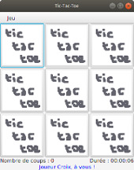
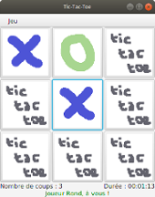
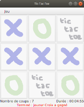
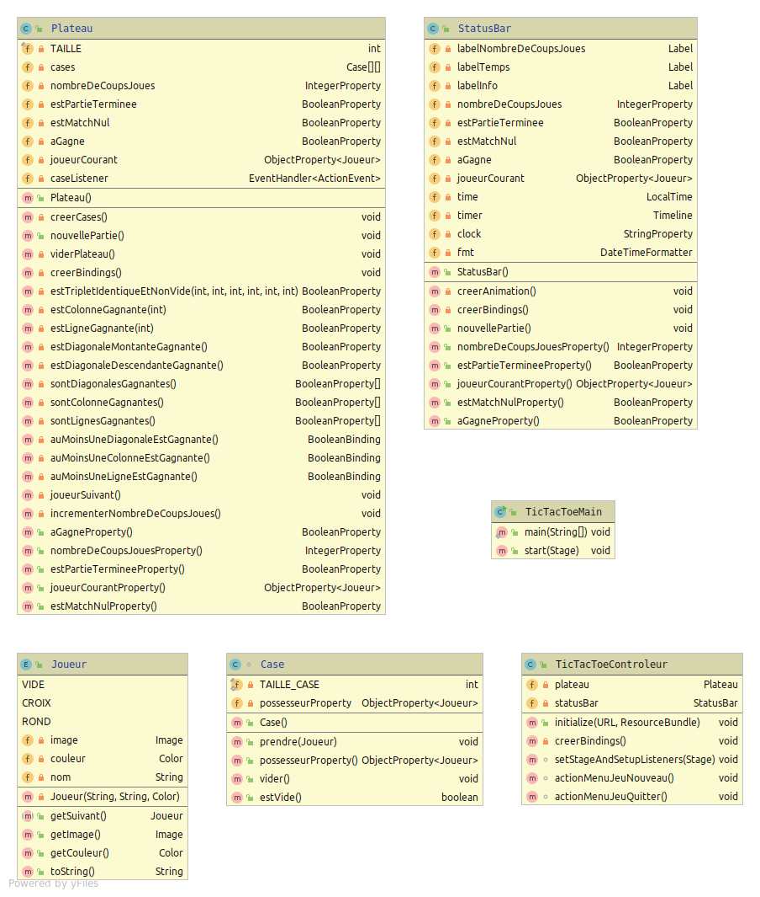

#  Test d'IHM 2016 : Tic-tac-toe (JavaFX)

### IUT d'Aix-Marseille - Département Informatique - DUT (Module M2105)

**Test du samedi 4 juin 2016 – Durée 2 heures – Documents autorisés**

L'objectif de cet exercice est la programmation d'une version JavaFx du jeu **Tic-tac-toe** (souvent nommé à tord morpion). Le tic-tac-toe est un jeu de réflexion se pratiquant à deux joueurs au tour par tour et dont le but est de créer le premier un alignement sur une grille. Le jeu se joue généralement avec papier et crayon.

## Règles du jeu

Le tic-tac-toe est souvent appelé « morpion », ce qui entraîne une confusion avec le jeu de Morpion qui lui ressemble par ses mécanismes mais dont le but est de former des lignes de cinq et non de trois sur un espace quadrillé. Le Tic-tac-toe se joue sur une grille carrée de 3×3 cases. Deux joueurs s'affrontent, respectivement appelés « Croix » et « Rond ». Ils doivent remplir chacun à leur tour une case de la grille avec le symbole qui leur est attribué : O (aussi dénommé rond) ou X (appelé croix). Le gagnant est celui qui arrive à aligner trois symboles identiques, horizontalement, verticalement ou en diagonale.

En raison du nombre limité de combinaisons, l'analyse complète du jeu est facile à réaliser : si les deux joueurs jouent chacun de manière optimale, la partie doit toujours se terminer par un match nul.

Le tic-tac-toe donne un avantage assez important à celui qui commence. Des formes évoluées existent, comme le Gomoku ou le Pente, qui ajoutent à la notion d'alignement une notion de prise. Le renju prévoit des handicaps pour le joueur qui commence, ce qui permet d'équilibrer les chances des deux joueurs. Une partie dure environ une minute.

Dans la versoin que vous allez implémenter, les deux joueurs sont des humains, l’ordinateur ne joue pas ; il ne fait que fournir le damier, la possibilité de cliquer sur les cases, l’affichage des deux signes (une croix et un rond) qui représentent les coups de chaque joueur et la détection de la fin de partie avec l’indication du joueur qui a gagné.

L'IHM que vous allez en partie réaliser ressemblera aux fenêtres suivantes :

+ la première montre une partie qui commence (le joueur croix commence toujours la partie)
+ la seconde montre une partie encours, où cela vient au joueur rond de jouer
+ la troisème montre une fin  de partie remportée par le joueur croix


    


L'objectif de ce test est d'évaluer votre capacité à écrire une IHM à l'aide du langage Java. L'essentiel de la logique du jeu sera gérée par des *bindings* ! En effet, le jeu est tellement simple que nous pouvons nous permettre ce genre de fantaisies, en particulier à l'occasion de cet examen...

L'application définit plusieurs types d'objets :
- Un objet `TicTacToeMain` est une application JavaFX permettant de jouer.
- Un objet `TicTacToeView` est la racine de la scène de jeu (l'intérieur de la fenêtre de l'image).
- Un objet `TicTacToeControleur` est la classe contrôleur de l'IHM décrite par `TicTacToeView`.
- Un objet `Plateau` est le plateau de jeu composé des 3 x 3 cases, que l'on voit au centre du `TicTacToetView`
- Un objet `Case` représente une case.
- Un objet `StatusBar` est la barre en bas du `TicTacToeView` qui affiche le nombre de coups joués, la durée de la partie et un message d'information coloré, indiquant le joueur qui doit jouer, ou celui qui a gagné ou s'il y a match nul.
- Un objet `Joueur` représente un joueur

Le diagramme UML suivant donne un aperçu synthétique de la structure des classes de l'application. Il n'est pas nécessaire de l'étudier pour l'instant, mais il vous sera très utile pour retrouver les données membres et méthodes des différentes classes.



Votre travail dans la suite de ce sujet sera d'écrire pas à pas plusieurs des classes ci-dessus. Le code des classes `Joueur` et `StatusBar` vous est donné en tout ou partie à titre d'information ci-dessous, pour que vous puissiez vous y référer si besoin au cours des exercices. 

### L'énumération  `Joueur`

Cette énumération (ou classe au nombre prédéfini d'instances) définit 3 joueurs : `VIDE`, `CROIX` et `ROND`, chacun avec le nom du fichier image qui le représente, son nom, sa couleur et le joueur suivant au cours de la partie. Ces instances serviront à indiquer quel joueur occupe une case. Son implémentation vous est donnée ci-dessous à titre d'information :

```java
import javafx.scene.image.Image;
import javafx.scene.paint.Color;

public enum Joueur {

  VIDE("vide.png", "Aucun", Color.RED) {
      public Joueur getSuivant() {
        return VIDE;
      }
    },

  CROIX("croix.png", "Croix", Color.BLUE) {
      public Joueur getSuivant() {
        return ROND;
      }
    },

  ROND("rond.png", "Rond", Color.GREEN) {
      public Joueur getSuivant() {
        return CROIX;
      }
    };

  private Image image;
  private Color couleur;
  private String nom;

  Joueur(String fileName, String nom, Color couleur) {
    this.image   = new Image("assets/" + fileName);
    this.couleur = couleur;
    this.nom = nom;
  }

  public abstract Joueur getSuivant();

  public Image getImage() { return this.image; }

  public Color getCouleur() { return this.couleur; }

  @Override public String toString() { return nom; }
}
```

Exemple d'utilisation :

```java
Joueur joueur = Joueur.CROIX;
System.out.println("Le joueur courant est " + joueur);  // affiche "Croix"
Joueur joueurSuivant = joueur.getSuivant();
```

### La classe `StatusBar`
La classe `StatusBar` est un composant graphique permettant d'afficher l'état de la partie en cours. 
L'implémentation partielle de cette classe vous est donnée ci-dessous (où la gestion et l'affichage de la durée ont été omis pour ne pas surcharger le texte):

```java 
public class StatusBar extends BorderPane implements Initializable {
public class StatusBar extends BorderPane {

    private Label labelNombreDeCoupsJoues = new Label();
    private Label labelTemps = new Label();
    private Label labelInfo = new Label();

    private IntegerProperty nombreDeCoupsJoues;
    private BooleanProperty estPartieTerminee;
    private BooleanProperty estMatchNul;
    private BooleanProperty aGagne;

    private ObjectProperty<Joueur> joueurCourant;

    private LocalTime time;
    private Timeline timer;
    private StringProperty clock;
    private DateTimeFormatter fmt;

    public StatusBar() {
        nombreDeCoupsJoues = new SimpleIntegerProperty();
        estPartieTerminee = new SimpleBooleanProperty();
        joueurCourant = new SimpleObjectProperty<>(Joueur.VIDE);
        estMatchNul = new SimpleBooleanProperty(false);
        aGagne = new SimpleBooleanProperty(false);

        time = LocalTime.now();
        clock = new SimpleStringProperty("00:00:00");
        fmt = DateTimeFormatter.ofPattern("HH:mm:ss").withZone(ZoneId.systemDefault());

        this.setLeft(labelNombreDeCoupsJoues);
        this.setRight(labelTemps);
        this.setBottom(labelInfo);

        BorderPane.setAlignment(labelInfo, Pos.CENTER);

        creerAnimation();
        creerBindings();
  }

  private void creerAnimation() {
      timer = new Timeline(new KeyFrame(Duration.ZERO, e ->  clock.set(LocalTime.now().minusNanos(time.toNanoOfDay()).format(fmt))),
                new KeyFrame(Duration.seconds(1)));
      timer.setCycleCount(Animation.INDEFINITE);
  }

  private void creerBindings() {
        labelTemps.textProperty().bind(concat("Durée : ", clock));
        
        // à compléter...
  }

  public void nouvellePartie() {
        time = LocalTime.now();
        timer.playFromStart();
  }

  public IntegerProperty nombreDeCoupsJouesProperty() {
        return nombreDeCoupsJoues;
  }

  public BooleanProperty estPartieTermineeProperty() {
        return estPartieTerminee;
  }

  public ObjectProperty<Joueur> joueurCourantProperty() {
        return joueurCourant;
  }

  public BooleanProperty estMatchNulProperty() {
        return estMatchNul;
  }

  public BooleanProperty aGagneProperty() {
        return aGagne;
  }
}
```

### Exercice 1 - Implémentation de la classe `Case`

Le plateau de jeu disposera de 3 x 3 **cases**. Chaque case sera occupée par l'un des joueurs : `Joueur.VIDE`, `Joueur.CROIX` ou `Joueur.ROND`. Cette information sera gérée et accessible par l'intermédiaire d'une propriété. En revanche, il ne sera pas nécesssaire d'enregistrer la position de la case sur le plateau.

1. Écrire la déclaration d'une classe publique `Case`, sous-classe de (étendant) `Button`, réduite pour le moment à la déclaration des variables d'instance suivantes, toutes privées (cf. diagramme UML) :
     - `TAILLE_CASE` de type int, est la constante contenant la taille d'une case et vaut 110.
     - `possesseurProperty` une propriété qui contient le `Joueur` occupant la case.
2. Écrire l'accesseur public `possesseurProperty()` de la propriété `possesseurProperty`.
3. Écrire la méthode `boolean estVide()` qui renvoie vrai ssi le joueur occupant la case est `Joueur.VIDE`.
4. Écrire la méthode publique `void prendre(Joueur joueur)` qui change le joueur occupant la case, et qui fixe comme graphique de ce bouton une nouvelle instance d'`ImageView` contenant l'image associée au nouvel occupant.
5. Écrire la méthode publique `void vider()` qui fait prendre la case par `Joueur.VIDE`.
6. Écrire le constructeur public `Case()` qui :
     - Initialise `possesseurProperty` avec une instance de la classe appropriée.
     - Fixe la largeur et la hauteur de la case à `TAILLE_CASE`. Aide : utilisez les méthodes `setMinSize()`, `setMaxSize()` et `setPrefSize()` qu'une `Case` hérite de `Button`.
     - Vide la case

### Exercice 2 - Implémentation de la classe `Plateau`

Cette classe est celle qui permet d'implémenter toute la logique du jeu, et qui gère et affiche les 3 x 3 cases du jeu. Elle comporte un grand nombre de propriétés et de méthodes (voir diagramme) dont vous n'aurez à écrire qu'une partie :

1. Écrire la classe `Plateau` qui dérive de `GridPane`. Cette classe aura les données membres privées suivantes :
   - `TAILLE` une constante de type `int` qui contient la valeur 3.
   - `cases` est une matrice de `TAILLE x TAILLE` objets de type `Case` qui représente le plateau de jeu.
   - `nombreDeCoupsJoues` de type `IntegerProperty` qui mémorise le nombre de coups joués depuis le début de la partie.
   - `joueurCourant` de type `ObjectProperty<Joueur>` qui mémorise le joueur courant
   - `estPartieTerminee` de type `BooleanProperty` qui permet de savoir si la partie est terminée.
   - `estMatchNul` de type `BooleanProperty` qui permet de savoir si la partie s'est terminée sur un match nul.
   - `aGagne` de type `BooleanProperty` qui permet de savoir si le joueur courant a gagné.
   - `caseListener` est un écouteur de case de type `EventHandler<ActionEvent>`.
2. Écrire le constructeur `Plateau()` qui initialise les 5 propriétés où pour le moment le joueur courant est `Joueur.VIDE`, puis qui fixe un espace vertical et horizontal de 3 pixels entre les cases, et appelle les méthodes `creerCases()`, `nouvellePartie()` et `creerBindings()`.
3. Écrire la méthode privée `void creerCases()` qui crée la matrice de `TAILLE x TAILLE` cases. Chaque case du plateau doit être créée avec un nouvelle instance de `Case`, doit avoir `caseListener` comme écouteur d'action, et doit être placée au bon endroit du plateau avec la méthode `add()` qu'il hérite de `GridPane`.
4. Écrire la méthode publique `void nouvellePartie()` qui appelle la méthode `viderPlateau()`, fixe le joueur courant à `Joueur.CROIX`, puis met à 0 le nombre de coups joués.
5. Écrire la méthode privée `void viderPlateau()` qui appelle la méthode `vider()` de toutes les cases du plateau
6. Écrire la méthode privée void `creerBindings()` qui s'occupe de correctement lier les propriétés `estPartieTerminee`, `estMatchNul` et `aGagne`, ainsi que la propriété `disable` héritée de `GridPane` (permettant de désactiver le plateau et les cases qu'il contient), accessible par la méthode (héritée) `diableProperty()` :
   - La partie est terminée si le joueur courant a gagné ou si le match est nul.
   - Le match est nul si le nombre de coups joués est le nombre de cases du plateau
   - Le joueur courant a gagné si au moins une ligne est gagnante ou au moins une colonne est gagnante ou au moins une diagonale est gagnante. Les propriétés définissant ces conditions sont respectivement fournies par les méthodes `auMoinsUneLigneEstGagnante()`, `auMoinsUneColonneEstGagnante()` et `auMoinsUneDiagonaleEstGagnante()` que vous n'avez pas à écrire (ni celles dont elles dépendent).
   - Soumettre la désactivation du plateau à la fin de partie.
7. Écrire la méthode privée `void joueurSuivant()` qui modifie le joueur courant pour passer au joueur suivant.
8. Écrire la méthode privée `void incrementerNombreDeCoupsJoues()` qui incrémente le nombre de coups joués.
9. Écrire la déclaration de `caseListener` sous forme d'une expression lambda. Cet écouteur doit gérer le clic sur une `Case`, ce qui teste si la case est vide et dans ce cas :
   - fait prendre la case par le joueur courant.
   - incrémente le nombre de coups joués.
   - passe au joueur suivant si la partie n'est pas encore terminée.

Même s'ils n'ont pas été écrits, vous supposerez dans la suite que vous disposez des accesseurs suivants pour différentes propriétés de cette classe :

+ pour `nombreDeCoupsJoues` : `nombreDeCoupsJouesProperty()`.
+ pour `joueurCourant` : `joueurCourantProperty()`.
+ pour `estPartieTerminee` : `estPartieTermineeProperty()`.
+ pour `aGagne` : `aGagneProperty()`.
+ pour `estMatchNul` : `estMatchNulProperty()`.

### Exercice 3 - Compléter la méthode `creerBindings()` de `StatusBar`

1. Compléter la méthode `creerBindings()` de la classe `StatusBar` (voir début du sujet) :
   + `labelNombreDeCoupsJoues` devra en permance contenir "Nombre de coups : " suivi du nombre de coups joués
   + `labelInfo` devra en permance contenir un message approprié à la situation tel qu'on peut le voir en début de sujet (à qui de jouer, match nul ou joueur gagnant). Pour cela, définir des `StringBinding` intermédiaires :
     + `messageJoueurCourant` qui contient "Joueur " suivi du joueur courant suivi de ", à vous !" quand le joueur courant n'est pas vide, sinon contient une chaîne vide.
     + `messageMatchNul` qui contient "Terminé : Match nul !" quand le match est nul, sinon contient `messageJoueurCourant`.
     + `messageInfoGagne` qui contient "Terminé : joueur " suivi du joueur courant suivi de " a gagné" quand `aGagne` est vrai, sinon contient `messageMatchNul`. Le texte de `labelInfo` sera finalement soumis à ce dernier `StringBinding`
   + la couleur du texte du `labelInfo` est modifiable par la méthode publique  `setTextFill(Color couleur)` de la classe `Label`. Elle doit dépendre de l'état de la partie :
     + écouter toute modification du joueur courant pour lui donner la couleur du joueur courant.
     + écouter toute modification de `estPartieTerminee` pour lui donner la couleur du joueur `VIDE` quand la partie est terminée.

### Exercice 4 - Implémentation de l'IHM

Outre le composant graphique `StatusBar`, l'IHM se compose d'un fichier FXML et d'une classe contrôleur pour ce fichier.

##### Exercice 4.A - FXML de la fenêtre principale

Le fichier `TicTacToeView.fxml` est la description de la fenêtre principale du Jeu. En plus du plateau situé **au centre**, cette fenêtre contient une barre de menu située **en haut**, et **en bas** la barre de statut. La barre de menu contient un menu "Jeu" constitué d'une entrée "Nouvelle Partie" et d'une entrée "Quitter".

1. Écrire le contenu de `TicTacToeView.fxml` en n'oubliant pas d’associer les actions adéquates aux items du menu (`actionMenuJeuNouveau()` et `actionMenuJeuQuitter()`). Penser à valoriser l'attribut `fx:id` pour être en mesure de récupérer la `StatusBar` et le `Plateau` dans le contrôleur.

##### Exercice 4.B - Contrôleur de la fenêtre principale

La classe `TicTacToeControleur` est chargée de contrôler la vue décrite par le fichier FXML :

1. Écrire la déclaration de la classe `TicTacToeControleur`. Cette classe disposera d'une donnée membre pour la barre de statut et pour le plateau. Ne pas oublier les annotations pour que la mise en correspondance vue/contrôleur puisse avoir lieu.
2. Écrire la méthode `public void initialize(URL location, ResourceBundle resources)` appelée juste après l'initialisation de la vue. Cette méthode doit lancer une nouvelle partie et appeler la méthode `creerBindings()`ci-dessous.
3. Écrire la méthode `private void creerBindings()` qui devra soumettre les propriétés de la barre de statut aux propriétés correspondantes du plateau.
4. Écrire la méthode `void actionMenuJeuNouveau()` qui relance une nouvelle partie sur le plateau et la barre de statut.
5. Écrire la méthode `void actionMenuJeuQuitter()` qui crée une alerte de type `CONFIRMATION` pour demander la confirmation avant de sortir correctement de l'application.
6. Écrire la méthode `void setStageAndSetupListener(Stage stage)` qui intercepte (l'événement demandant) la fermeture de la fenêtre pour appeler `actionMenuJeuQuitter()` puis consommer l'événement de fermeture

### Exercice 5 - Implémentation de la classe `TicTacToeMain`

La classe `TicTacToeMain` est le programme principal de notre application. C'est elle qui a la responsabilité de charger la vue principale et de l'ajouter à la scène.

1. Écrivez une méthode `main` aussi réduite que possible pour lancer l’exécution de tout cela.
2. Écrire la méthode `public void start(Stage primaryStage)`. Elle devra :
   + Modifier le titre de la fenêtre en "Tic-Tac-Toe".
   + Créer un objet `loader` du type `FXMLLoader` et charger le `BorderPane` principal à partir du fichier `TicTacToeView.fxml`.
   + Récupérer le contrôleur du type `TicTacToeControleur` avec la méthode `getController()` du `loader`.
   + Appeler la méthode `setStageAndSetupListeners()` de la classe `TicTacToeControleur` qui rajoutera l'écouteur d’évènement de fermeture de la fenêtre principale.
   + Ajouter le `BorderPane` comme racine du graphe de scène.
   + Rendre visible le stage.

*That's all !*
