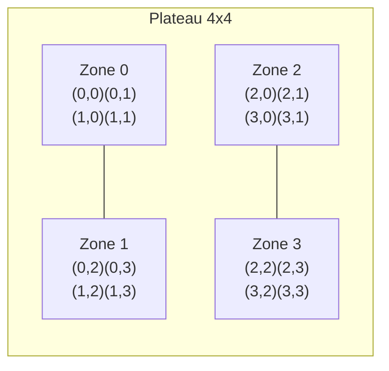

# Test d'Artisanat logiciel et qualité de développement

### Test du jeudi 18 juin 2026 - Durée 2 heures - Documents non autorisés

L'objectif de ce sujet est la programmation de la **logique** du jeu **Quantik**.

**Quantik** est un jeu de stratégie abstrait édité par Gigamic (Nouredine Hilal, 2019). Deux
joueurs s'affrontent sur un plateau de 4x4 cases, découpé en quatre zones de 2x2 cases. Chaque joueur
dispose de huit pièces : deux exemplaires de chacune des quatre formes (cube, sphère, cylindre, cône).

### Description du jeu

Les joueurs posent à tour de rôle une de leurs pièces sur une case vide, en respectant **une seule
règle de pose** : Il est interdit de poser une forme sur une ligne, une colonne ou une zone qui contient déjà cette forme, **quel que soit le joueur** à qui appartient la pièce déjà en place.

La condition de victoire est tout aussi simple : Gagne la partie le joueur qui **pose la pièce complétant** une ligne, une colonne ou une zone contenant les **quatre formes différentes** (peu importe à qui appartiennent les quatre pièces).

Enfin, un joueur qui ne peut plus jouer (aucun coup légal possible) a perdu : son adversaire gagne.

L'interface graphique correspondante (réalisée dans le sujet R2.02) donne une idée du jeu :


Le plateau est découpé en zones qui sont numérotées de la façon suivante (les indices de zone vont de 0 à 3) :



### Travail à réaliser

L'objectif de ce sujet est d'évaluer votre capacité à écrire du code propre et testé en Java. Les
méthodes trop algorithmiques vous seront fournies. Vous pourrez retrouver une proposition de
correction à l'adresse suivante : <https://github.com/IUTInfoAix-R202/TestIHM2026/>.

La logique du jeu repose sur les types suivants, tous dans le paquet `fr.univ_amu.iut.modele` :

- une énumération `Forme` (les quatre formes) et une énumération `Joueur` (les deux joueurs) ;
- un record `Piece` qui associe une forme à un propriétaire ;
- une classe `Reserve` qui mémorise les pièces restantes d'un joueur ;
- une classe `Plateau` qui gère la grille, les contraintes de pose et la détection de victoire.

Vous écrirez ces classes pas à pas. Les tests sont écrits avec **JUnit 5** et **AssertJ**
(`assertThat(...)`).

## Exercice 1 - Les pièces

Une pièce est une **forme** appartenant à un **joueur**. Tous les types de ce sujet sont à créer dans le paquet `fr.univ_amu.iut.modele`.

1. Écrire l'énumération publique `Forme` qui déclare, dans cet ordre, les quatre valeurs `CUBE`,`SPHERE`, `CYLINDRE`, `CONE`.

2. Écrire l'énumération publique `Joueur` qui déclare les deux valeurs `BLANC` et `NOIR`.

3. Ajouter à `Joueur` une méthode d'instance `public Joueur adversaire()` qui renvoie l'autre joueur(`NOIR` pour `BLANC`, et `BLANC` pour `NOIR`). Elle doit valider le test suivant :

   ```java
   @Test
   void adversaireRenvoieLAutreJoueur() {
       assertThat(Joueur.BLANC.adversaire()).isEqualTo(Joueur.NOIR);
       assertThat(Joueur.NOIR.adversaire()).isEqualTo(Joueur.BLANC);
   }
   ```

4. Écrire le record public `Piece` avec exactement deux composants, dans cet ordre : `Forme forme` et `Joueur proprietaire` (Rappel : un record fournit automatiquement le constructeur, les accesseurs `forme()` et `proprietaire()`, ainsi que `equals`).


## Exercice 2 - La réserve

La classe `Reserve` mémorise les pièces qu'il reste à un joueur. Au début de la partie, chaque joueur possède deux pièces de chaque forme.

1. Écrire la classe publique `Reserve` avec deux champs : le `Joueur proprietaire` et un `Map<Forme,Integer> stock` (par exemple une `EnumMap<>(Forme.class)`). Écrire le constructeur `public Reserve(Joueur proprietaire)` qui mémorise le propriétaire et, pour chaque valeur de `Forme.values()`, range la valeur `2` dans `stock`.

2. Écrire la méthode `public int compte(Forme forme)` qui renvoie le nombre de pièces restantes d'une forme (la valeur associée à `forme` dans `stock`). Elle doit valider :

   ```java
   @Test
   void uneReserveNeuveContientDeuxPiecesDeChaqueForme() {
       Reserve reserve = new Reserve(Joueur.BLANC);
       for (Forme forme : Forme.values()) {
           assertThat(reserve.compte(forme)).isEqualTo(2);
       }
   }
   ```

3. Écrire la méthode `public Piece prendre(Forme forme)` qui décrémente de 1 le compte de `forme` dans `stock` et renvoie `new Piece(forme, proprietaire)`. Elle doit valider :

   ```java
   @Test
   void prendreDiminueLeCompteEtRenvoieLaBonnePiece() {
       Reserve reserve = new Reserve(Joueur.NOIR);
       assertThat(reserve.prendre(Forme.CONE)).isEqualTo(new Piece(Forme.CONE, Joueur.NOIR));
       assertThat(reserve.compte(Forme.CONE)).isEqualTo(1);
   }
   ```

4. Compléter `prendre` : si le compte de `forme` est déjà `0`, lever une `IllegalArgumentException` (sans rien modifier).

   ```java
   @Test
   void prendreUneFormeEpuiseeLeveUneException() {
       Reserve reserve = new Reserve(Joueur.BLANC);
       reserve.prendre(Forme.CUBE);
       reserve.prendre(Forme.CUBE);
       assertThatThrownBy(() -> reserve.prendre(Forme.CUBE))
           .isInstanceOf(IllegalArgumentException.class);
   }
   ```

5. Écrire la méthode `public boolean estVide()` qui renvoie `true` si toutes les formes ont un compte de `0`.


## Exercice 3 - Le plateau et ses règles

La classe `Plateau` mémorise une grille 4x4 dans un champ privé `Piece[][] cases` (une case vide vaut
`null`). Déclarer une constante `public static final int TAILLE = 4;` et initialiser le champ avec `new
Piece[TAILLE][TAILLE]`. C'est le cœur du sujet.

1. Écrire la classe `Plateau` avec son champ `cases`, la méthode `public boolean estVide(int ligne, int
   colonne)` (vrai si `cases[ligne][colonne]` vaut `null`) et la méthode `public Piece pieceEn(int ligne,
   int colonne)` (qui renvoie `cases[ligne][colonne]`).

2. Écrire la méthode **statique** `public static int zoneDe(int ligne, int colonne)` qui renvoie
   l'indice (0 à 3) de la zone 2x2 contenant la case. La formule est donnée : `2 * (ligne / 2) +
   (colonne / 2)`.

   ```java
   @ParameterizedTest
   @CsvSource({ "0,0,0", "1,1,0", "0,3,1", "2,1,2", "3,3,3" })
   void zoneDeDecoupeLePlateau(int ligne, int colonne, int zoneAttendue) {
       assertThat(Plateau.zoneDe(ligne, colonne)).isEqualTo(zoneAttendue);
   }
   ```

3. La méthode privée qui teste la présence d'une forme sur une ligne vous est donnée (ci-dessous). Sur
   ce modèle, écrire les deux méthodes privées `boolean formePresenteSurColonne(Forme forme, int
   colonne)` (qui parcourt les lignes de la colonne) et `boolean formePresenteDansZone(Forme forme, int
   ligne, int colonne)` (qui parcourt les cases dont `zoneDe(...)` est égale à la zone de la case
   visée).

   ```java
   private boolean formePresenteSurLigne(Forme forme, int ligne) {
       for (int c = 0; c < TAILLE; c++) {
           Piece piece = cases[ligne][c];
           if (piece != null && piece.forme() == forme) {
               return true;
           }
       }
       return false;
   }
   ```

4. Écrire la méthode `public boolean peutPoser(Forme forme, int ligne, int colonne)` : elle renvoie
   `true` si la case est vide (`estVide`) **et** qu'aucune des trois méthodes de présence (celle fournie
   pour la ligne, et celles de la question 3 pour la colonne et la zone) ne détecte la présence de
   `forme`.

   ```java
   @Test
   void onNePeutPasPoserLaMemeFormeSurLaMemeLigne() {
       Plateau plateau = new Plateau();
       plateau.poser(new Piece(Forme.CUBE, Joueur.BLANC), 0, 0);
       assertThat(plateau.peutPoser(Forme.CUBE, 0, 3)).isFalse();
   }
   @Test
   void onPeutPoserUneFormeDifferenteSurLaMemeLigne() {
       Plateau plateau = new Plateau();
       plateau.poser(new Piece(Forme.CUBE, Joueur.BLANC), 0, 0);
       assertThat(plateau.peutPoser(Forme.SPHERE, 0, 1)).isTrue();
   }
   ```

5. Écrire la méthode `public void poser(Piece piece, int ligne, int colonne)` : si `peutPoser(piece.forme(),
   ligne, colonne)` est faux, lever une `IllegalArgumentException` ; sinon, ranger la pièce dans
   `cases[ligne][colonne]`.

6. Écrire la méthode **statique** `public static boolean estAlignementComplet(Piece[] quatre)` : elle
   renvoie `true` si le tableau ne contient aucun `null` **et** que les quatre pièces ont quatre formes
   différentes. Astuce : ajouter les quatre formes à un `EnumSet<Forme>` et vérifier que sa taille vaut
   `TAILLE` (soit 4).

7. En supposant disposer des méthodes privées `ligne(int)`, `colonne(int)` et `zone(int)` (qui renvoient
   chacune le tableau des quatre pièces de l'alignement correspondant), écrire `public boolean
   estVictoireApres(int ligne, int colonne)` : elle renvoie `true` si `estAlignementComplet` est vrai
   pour la ligne, **ou** pour la colonne, **ou** pour la zone de la case `(ligne, colonne)`.

   ```java
   @Test
   void completerUneLigneEstUneVictoire() {
       Plateau plateau = new Plateau();
       plateau.poser(new Piece(Forme.CUBE, Joueur.BLANC), 0, 0);
       plateau.poser(new Piece(Forme.SPHERE, Joueur.NOIR), 0, 1);
       plateau.poser(new Piece(Forme.CYLINDRE, Joueur.BLANC), 0, 2);
       plateau.poser(new Piece(Forme.CONE, Joueur.NOIR), 0, 3);
       assertThat(plateau.estVictoireApres(0, 3)).isTrue();
   }
   ```
