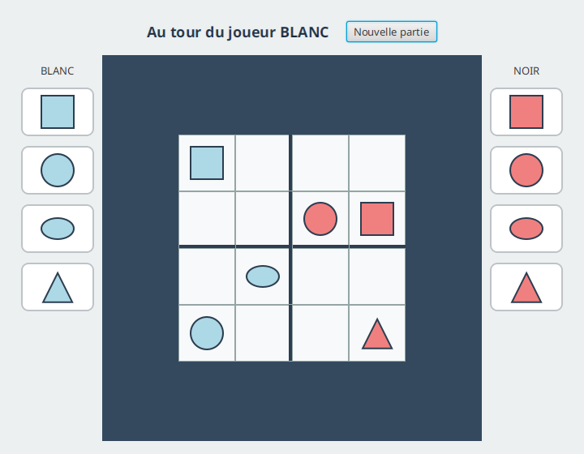
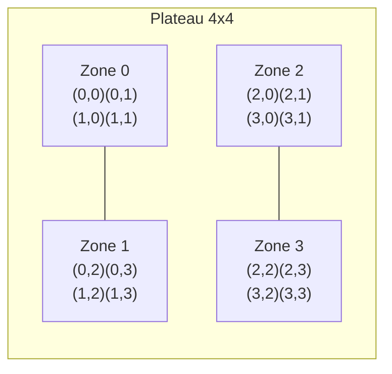

# Test d'Artisanat logiciel et qualité de développement

### Test du jeudi 18 juin 2026 - Durée 2 heures - Documents non autorisés

L'objectif de ce sujet est la programmation de la **logique** du jeu **Quantik**.

**Quantik** est un jeu de stratégie abstrait édité par Gigamic (auteur : Nouredine Hilal, 2019). Deux
joueurs s'affrontent sur un plateau de 4x4 cases, découpé en quatre zones de 2x2 cases. Chaque joueur
dispose de huit pièces : deux exemplaires de chacune des quatre formes (cube, sphère, cylindre, cône).

### Description du jeu

Les joueurs posent à tour de rôle une de leurs pièces sur une case vide, en respectant **une seule
règle de pose** :

> Il est interdit de poser une forme sur une ligne, une colonne ou une zone qui contient déjà cette
> forme, **quel que soit le joueur** à qui appartient la pièce déjà en place.

La condition de victoire est tout aussi simple :

> Gagne la partie le joueur qui **pose la pièce complétant** une ligne, une colonne ou une zone
> contenant les **quatre formes différentes** (peu importe à qui appartiennent les quatre pièces).

Enfin, un joueur qui ne peut plus jouer (aucun coup légal possible) a perdu : son adversaire gagne.

L'interface graphique correspondante (réalisée dans le sujet R2.02) donne une idée du jeu :



Le plateau est numéroté de la façon suivante (les indices de zone vont de 0 à 3) :



### Travail à réaliser

L'objectif de ce sujet est d'évaluer votre capacité à écrire du code propre et testé en Java. Les
méthodes trop algorithmiques vous seront fournies. Vous pourrez retrouver une proposition de
correction à l'adresse suivante : <https://github.com/IUTInfoAix-R202/TestIHM2026/>.

La logique du jeu repose sur les types suivants, tous dans le paquet `fr.univ_amu.iut.modele` :

- une énumération `Forme` (les quatre formes) et une énumération `Joueur` (les deux joueurs) ;
- un record `Piece` qui associe une forme à un propriétaire ;
- une classe `Reserve` qui mémorise les pièces restantes d'un joueur ;
- une classe `Plateau` qui gère la grille, les contraintes de pose et la détection de victoire ;
- une classe `Partie` qui orchestre le déroulement (tour de jeu, fin de partie).

Vous écrirez ces classes pas à pas. Les tests sont écrits avec **JUnit 5** et **AssertJ**
(`assertThat(...)`).

---

## Partie A - Les pièces et les réserves

### Exercice 1 - Les énumérations `Forme` et `Joueur`

1. Écrire l'énumération `Forme` qui déclare les quatre valeurs `CUBE`, `SPHERE`, `CYLINDRE`, `CONE`.

2. Écrire l'énumération `Joueur` qui déclare les deux valeurs `BLANC` et `NOIR`. Ajouter une méthode
   d'instance `Joueur adversaire()` qui renvoie l'autre joueur. Elle doit valider le test suivant :

   ```java
   @Test
   void adversaireRenvoieLAutreJoueur() {
       assertThat(Joueur.BLANC.adversaire()).isEqualTo(Joueur.NOIR);
       assertThat(Joueur.NOIR.adversaire()).isEqualTo(Joueur.BLANC);
   }
   ```

### Exercice 2 - Le record `Piece`

Écrire le record `Piece` qui possède deux composants : une `Forme forme` et un `Joueur proprietaire`.
Grâce au record, l'égalité est automatique. Votre code doit valider :

```java
@Test
void deuxPiecesIdentiquesSontEgales() {
    assertThat(new Piece(Forme.SPHERE, Joueur.NOIR))
        .isEqualTo(new Piece(Forme.SPHERE, Joueur.NOIR));
}
```

### Exercice 3 - La classe `Reserve`

Au début de la partie, chaque joueur possède deux pièces de chaque forme.

1. Écrire la classe `Reserve`. Son constructeur `Reserve(Joueur proprietaire)` mémorise le
   propriétaire et initialise un stock de deux pièces par forme. On pourra utiliser une
   `Map<Forme, Integer>` (par exemple une `EnumMap`).

2. Écrire la méthode `int compte(Forme forme)` qui renvoie le nombre de pièces restantes d'une forme.
   Elle doit valider :

   ```java
   @Test
   void uneReserveNeuveContientDeuxPiecesDeChaqueForme() {
       Reserve reserve = new Reserve(Joueur.BLANC);
       for (Forme forme : Forme.values()) {
           assertThat(reserve.compte(forme)).isEqualTo(2);
       }
   }
   ```

3. Écrire la méthode `Piece prendre(Forme forme)` qui retire une pièce de la forme demandée et la
   renvoie (avec le bon propriétaire). Si la forme est épuisée, la méthode lève une
   `IllegalArgumentException`. Elle doit valider les deux tests suivants :

   ```java
   @Test
   void prendreDiminueLeCompteEtRenvoieLaBonnePiece() {
       Reserve reserve = new Reserve(Joueur.NOIR);
       assertThat(reserve.prendre(Forme.CONE)).isEqualTo(new Piece(Forme.CONE, Joueur.NOIR));
       assertThat(reserve.compte(Forme.CONE)).isEqualTo(1);
   }

   @Test
   void prendreUneFormeEpuiseeLeveUneException() {
       Reserve reserve = new Reserve(Joueur.BLANC);
       reserve.prendre(Forme.CUBE);
       reserve.prendre(Forme.CUBE);
       assertThatThrownBy(() -> reserve.prendre(Forme.CUBE))
           .isInstanceOf(IllegalArgumentException.class);
   }
   ```

---

## Partie B - Le plateau et les contraintes (cœur du sujet)

La classe `Plateau` mémorise une grille 4x4 dans un tableau `Piece[4][4]` (une case vide vaut
`null`). On définit une constante `public static final int TAILLE = 4;`.

### Exercice 4 - Les bases du plateau

1. Écrire la classe `Plateau` avec son tableau de cases. Écrire la méthode
   `boolean estVide(int ligne, int colonne)` qui indique si une case est libre, et la méthode
   `Piece pieceEn(int ligne, int colonne)` qui renvoie la pièce présente (ou `null`).

2. Écrire la méthode **statique** `int zoneDe(int ligne, int colonne)` qui renvoie l'indice (0 à 3)
   de la zone 2x2 contenant la case. On rappelle la formule : `2 * (ligne / 2) + (colonne / 2)`.
   Elle doit valider, entre autres :

   ```java
   @ParameterizedTest
   @CsvSource({ "0,0,0", "1,1,0", "0,3,1", "2,1,2", "3,3,3" })
   void zoneDeDecoupeLePlateau(int ligne, int colonne, int zoneAttendue) {
       assertThat(Plateau.zoneDe(ligne, colonne)).isEqualTo(zoneAttendue);
   }
   ```

### Exercice 5 - Les contraintes de pose

On souhaite savoir si une forme est déjà présente sur une ligne, une colonne ou une zone. La méthode
privée pour la ligne vous est donnée :

```java
private boolean formePresenteSurLigne(Forme forme, int ligne) {
    for (int c = 0; c < TAILLE; c++) {
        Piece piece = cases[ligne][c];
        if (piece != null && piece.forme() == forme) {
            return true;
        }
    }
    return false;
}
```

1. Sur ce modèle, écrire la méthode privée `boolean formePresenteSurColonne(Forme forme, int colonne)`.

2. Écrire la méthode privée `boolean formePresenteDansZone(Forme forme, int ligne, int colonne)`. On
   parcourra les cases dont la zone (via `zoneDe`) est celle de `(ligne, colonne)`.

### Exercice 6 - La méthode `peutPoser`

Écrire la méthode `boolean peutPoser(Forme forme, int ligne, int colonne)`. Une pose est autorisée si
la case est vide **et** qu'aucune des trois contraintes (ligne, colonne, zone) n'est violée. Cette
méthode est centrale : elle doit valider les tests suivants.

```java
@Test
void surUnPlateauVideLaPoseEstPossible() {
    assertThat(new Plateau().peutPoser(Forme.CUBE, 0, 0)).isTrue();
}

@Test
void onNePeutPasPoserLaMemeFormeSurLaMemeLigne() {
    Plateau plateau = new Plateau();
    plateau.poser(new Piece(Forme.CUBE, Joueur.BLANC), 0, 0);
    assertThat(plateau.peutPoser(Forme.CUBE, 0, 3)).isFalse();
}

@Test
void laContrainteIgnoreLeProprietaire() {
    Plateau plateau = new Plateau();
    plateau.poser(new Piece(Forme.CUBE, Joueur.NOIR), 0, 0);
    assertThat(plateau.peutPoser(Forme.CUBE, 0, 1)).isFalse();
}

@Test
void onPeutPoserUneFormeDifferenteSurLaMemeLigne() {
    Plateau plateau = new Plateau();
    plateau.poser(new Piece(Forme.CUBE, Joueur.BLANC), 0, 0);
    assertThat(plateau.peutPoser(Forme.SPHERE, 0, 1)).isTrue();
}
```

### Exercice 7 - La méthode `poser`

Écrire la méthode `void poser(Piece piece, int ligne, int colonne)` qui place une pièce sur le
plateau. Si le coup n'est pas légal (voir `peutPoser`), la méthode lève une
`IllegalArgumentException`.

```java
@Test
void poserUnCoupInterditLeveUneException() {
    Plateau plateau = new Plateau();
    plateau.poser(new Piece(Forme.CUBE, Joueur.BLANC), 0, 0);
    assertThatThrownBy(() -> plateau.poser(new Piece(Forme.CUBE, Joueur.NOIR), 0, 1))
        .isInstanceOf(IllegalArgumentException.class);
}
```

### Exercice 8 - La détection de victoire

1. Écrire la méthode **statique** `boolean estAlignementComplet(Piece[] quatre)` qui renvoie `true`
   si le tableau contient quatre pièces (aucune `null`) dont les **quatre formes sont différentes**.
   On pourra utiliser un `EnumSet<Forme>`.

   ```java
   @Test
   void quatreFormesDifferentesFormentUnAlignementComplet() {
       Piece[] a = {
           new Piece(Forme.CUBE, Joueur.BLANC), new Piece(Forme.SPHERE, Joueur.NOIR),
           new Piece(Forme.CYLINDRE, Joueur.BLANC), new Piece(Forme.CONE, Joueur.NOIR)
       };
       assertThat(Plateau.estAlignementComplet(a)).isTrue();
   }
   ```

2. En supposant disposer de trois méthodes privées `ligne(int)`, `colonne(int)` et `zone(int)` qui
   renvoient chacune le tableau des quatre pièces de l'alignement correspondant, écrire la méthode
   `boolean estVictoireApres(int ligne, int colonne)`. Elle vérifie si la **ligne**, la **colonne**
   ou la **zone** de la dernière case jouée forme un alignement complet.

   ```java
   @Test
   void completerUneLigneEstUneVictoire() {
       Plateau plateau = new Plateau();
       plateau.poser(new Piece(Forme.CUBE, Joueur.BLANC), 0, 0);
       plateau.poser(new Piece(Forme.SPHERE, Joueur.NOIR), 0, 1);
       plateau.poser(new Piece(Forme.CYLINDRE, Joueur.BLANC), 0, 2);
       plateau.poser(new Piece(Forme.CONE, Joueur.NOIR), 0, 3);
       assertThat(plateau.estVictoireApres(0, 3)).isTrue();
   }
   ```

---

## Partie C - Le déroulement de la partie

La classe `Partie` réunit un `Plateau`, deux `Reserve` (une par joueur), le joueur courant et un
état. On dispose d'une énumération `Etat { EN_COURS, VICTOIRE_BLANC, VICTOIRE_NOIR }` (donnée) et d'un
record `Coup(Forme forme, int ligne, int colonne)` (donné).

### Exercice 9 - La classe `Partie`

Écrire la classe `Partie`. Son constructeur crée un plateau vide, deux réserves pleines, fixe le
joueur courant à `BLANC` et l'état à `EN_COURS`. Écrire les accesseurs `plateau()`,
`joueurCourant()`, `etat()` et `reserve(Joueur joueur)`. Le constructeur doit valider :

```java
@Test
void uneNouvellePartieEstEnCoursEtCEstAuBlancDeJouer() {
    Partie partie = new Partie();
    assertThat(partie.etat()).isEqualTo(Etat.EN_COURS);
    assertThat(partie.joueurCourant()).isEqualTo(Joueur.BLANC);
}
```

### Exercice 10 - Les coups possibles

Écrire la méthode `List<Coup> coupsPossibles(Joueur joueur)` qui renvoie tous les coups légaux d'un
joueur : pour chaque forme dont il lui reste au moins une pièce, et pour chaque case où `peutPoser`
est vrai, on ajoute un `Coup`. Elle doit valider :

```java
@Test
void surUnPlateauVideIlYaSoixanteQuatreCoupsPossibles() {
    // 4 formes disponibles x 16 cases libres
    assertThat(new Partie().coupsPossibles(Joueur.BLANC)).hasSize(64);
}
```

### Exercice 11 - Jouer un coup

Écrire la méthode `void jouer(Forme forme, int ligne, int colonne)` qui fait jouer le joueur courant.
Elle doit, dans l'ordre :

1. lever une `IllegalStateException` si la partie est déjà terminée ;
2. lever une `IllegalArgumentException` si la forme est épuisée ou si le coup est interdit ;
3. prendre la pièce dans la réserve du joueur courant et la poser sur le plateau ;
4. si la pose complète un alignement, fixer l'état à la victoire du joueur courant ;
5. sinon, si l'adversaire n'a plus aucun coup possible, fixer également la victoire du joueur courant
   (l'adversaire est bloqué) ;
6. sinon, passer la main à l'adversaire.

```java
@Test
void jouerUnCoupNonDecisifPasseLaMain() {
    Partie partie = new Partie();
    partie.jouer(Forme.CUBE, 0, 0);
    assertThat(partie.joueurCourant()).isEqualTo(Joueur.NOIR);
}

@Test
void onNePeutPlusJouerUneFoisLaPartieTerminee() {
    Partie partie = new Partie();   // ... après une partie gagnée ...
    // assertThatThrownBy(() -> partie.jouer(...)).isInstanceOf(IllegalStateException.class);
}
```

---

## Partie D - Test d'intégration

### Exercice 12 - Une partie complète

Écrire un test d'intégration qui enchaîne une suite de coups menant à une victoire et vérifie l'état
final de la partie. Par exemple, la séquence suivante fait gagner le joueur `BLANC` en complétant la
ligne 0 :

```java
@Test
void leBlancGagneEnCompletantLaLigneZero() {
    Partie partie = new Partie();
    partie.jouer(Forme.CUBE, 0, 0);     // BLANC
    partie.jouer(Forme.SPHERE, 0, 1);   // NOIR
    partie.jouer(Forme.CYLINDRE, 0, 2); // BLANC
    partie.jouer(Forme.CUBE, 3, 3);     // NOIR (coup neutre)
    partie.jouer(Forme.CONE, 0, 3);     // BLANC complète la ligne 0
    assertThat(partie.etat()).isEqualTo(Etat.VICTOIRE_BLANC);
}
```

---

## Bonus

- **Bonus 1** : écrire `Coup suggereCoupSauf(Coup interdit)` qui propose un coup légal au joueur
  courant en évitant un coup donné (anticipation à un coup).
- **Bonus 2** : écrire `boolean estSymetrique()` qui indique si la configuration du plateau est
  symétrique par rapport à son centre.
