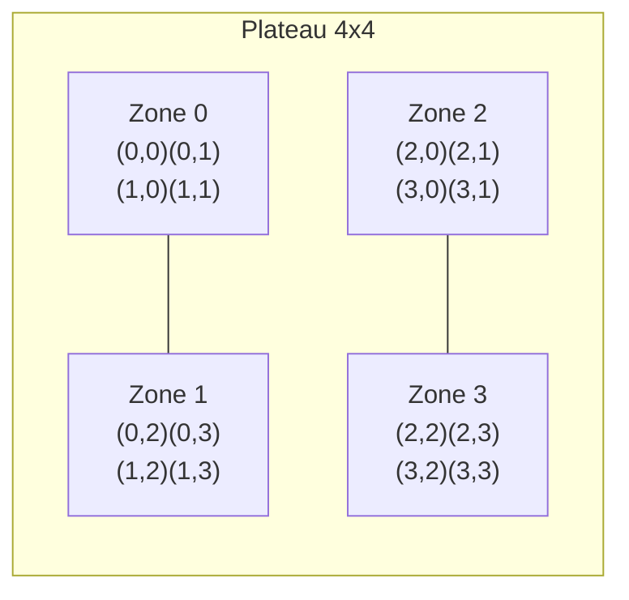

# Test d'Artisanat logiciel et qualité de développement

### Test du jeudi 18 juin 2026 - Durée 2 heures - Documents non autorisés

L'objectif de ce sujet est la programmation de la **logique** du jeu **Quantik**.

**Quantik** est un jeu de stratégie abstrait édité par Gigamic (auteur : Nouredine Hilal, 2019). Deux
joueurs s'affrontent sur un plateau de 4x4 cases, découpé en quatre zones de 2x2 cases. Chaque joueur
dispose de huit pièces : deux exemplaires de chacune des quatre formes (cube, sphère, cylindre, cône).

### Description du jeu

Les joueurs posent à tour de rôle une de leurs pièces sur une case vide, en respectant **une seule
règle de pose** :

> Il est interdit de poser une forme sur une ligne, une colonne ou une zone qui contient déjà cette
> forme, **quel que soit le joueur** à qui appartient la pièce déjà en place.

La condition de victoire est tout aussi simple :

> Gagne la partie le joueur qui **pose la pièce complétant** une ligne, une colonne ou une zone
> contenant les **quatre formes différentes** (peu importe à qui appartiennent les quatre pièces).

Enfin, un joueur qui ne peut plus jouer (aucun coup légal possible) a perdu : son adversaire gagne.

L'interface graphique correspondante (réalisée dans le sujet R2.02) donne une idée du jeu :


Le plateau est numéroté de la façon suivante (les indices de zone vont de 0 à 3) :



### Travail à réaliser

L'objectif de ce sujet est d'évaluer votre capacité à écrire du code propre et testé en Java. Les
méthodes trop algorithmiques vous seront fournies. Vous pourrez retrouver une proposition de
correction à l'adresse suivante : <https://github.com/IUTInfoAix-R202/TestIHM2026/>.

La logique du jeu repose sur les types suivants, tous dans le paquet `fr.univ_amu.iut.modele` :

- une énumération `Forme` (les quatre formes) et une énumération `Joueur` (les deux joueurs) ;
- un record `Piece` qui associe une forme à un propriétaire ;
- une classe `Reserve` qui mémorise les pièces restantes d'un joueur ;
- une classe `Plateau` qui gère la grille, les contraintes de pose et la détection de victoire ;
- une classe `Partie` qui orchestre le déroulement (tour de jeu, fin de partie).

Vous écrirez ces classes pas à pas. Les tests sont écrits avec **JUnit 5** et **AssertJ**
(`assertThat(...)`).

---

## Exercice 1 - Les pièces

Une pièce est une **forme** appartenant à un **joueur**.

1. Écrire l'énumération `Forme` qui déclare les quatre valeurs `CUBE`, `SPHERE`, `CYLINDRE`, `CONE`.

2. Écrire l'énumération `Joueur` qui déclare les deux valeurs `BLANC` et `NOIR`.

3. Ajouter à `Joueur` une méthode d'instance `Joueur adversaire()` qui renvoie l'autre joueur. Elle
   doit valider le test suivant :

   ```java
   @Test
   void adversaireRenvoieLAutreJoueur() {
       assertThat(Joueur.BLANC.adversaire()).isEqualTo(Joueur.NOIR);
       assertThat(Joueur.NOIR.adversaire()).isEqualTo(Joueur.BLANC);
   }
   ```

4. Écrire le record `Piece` qui possède deux composants : une `Forme forme` et un `Joueur
   proprietaire`.

5. Vérifier que l'égalité du record fonctionne, avec le test suivant :

   ```java
   @Test
   void deuxPiecesIdentiquesSontEgales() {
       assertThat(new Piece(Forme.SPHERE, Joueur.NOIR))
           .isEqualTo(new Piece(Forme.SPHERE, Joueur.NOIR));
   }
   ```

---

## Exercice 2 - La réserve

La classe `Reserve` mémorise les pièces qu'il reste à un joueur. Au début de la partie, chaque joueur
possède deux pièces de chaque forme.

1. Écrire la classe `Reserve` et son constructeur `Reserve(Joueur proprietaire)` qui mémorise le
   propriétaire et initialise un stock de deux pièces par forme (on pourra utiliser une `EnumMap<Forme,
   Integer>`).

2. Écrire la méthode `int compte(Forme forme)` qui renvoie le nombre de pièces restantes d'une forme.
   Elle doit valider :

   ```java
   @Test
   void uneReserveNeuveContientDeuxPiecesDeChaqueForme() {
       Reserve reserve = new Reserve(Joueur.BLANC);
       for (Forme forme : Forme.values()) {
           assertThat(reserve.compte(forme)).isEqualTo(2);
       }
   }
   ```

3. Écrire la méthode `Piece prendre(Forme forme)` qui retire une pièce de la forme demandée et la
   renvoie (avec le bon propriétaire). Elle doit valider :

   ```java
   @Test
   void prendreDiminueLeCompteEtRenvoieLaBonnePiece() {
       Reserve reserve = new Reserve(Joueur.NOIR);
       assertThat(reserve.prendre(Forme.CONE)).isEqualTo(new Piece(Forme.CONE, Joueur.NOIR));
       assertThat(reserve.compte(Forme.CONE)).isEqualTo(1);
   }
   ```

4. Compléter `prendre` pour qu'elle lève une `IllegalArgumentException` quand la forme est épuisée.

   ```java
   @Test
   void prendreUneFormeEpuiseeLeveUneException() {
       Reserve reserve = new Reserve(Joueur.BLANC);
       reserve.prendre(Forme.CUBE);
       reserve.prendre(Forme.CUBE);
       assertThatThrownBy(() -> reserve.prendre(Forme.CUBE))
           .isInstanceOf(IllegalArgumentException.class);
   }
   ```

5. Écrire la méthode `boolean estVide()` qui indique si la réserve ne contient plus aucune pièce.

---

## Exercice 3 - Le plateau et ses règles

La classe `Plateau` mémorise une grille 4x4 dans un tableau `Piece[4][4]` (une case vide vaut
`null`). On définit une constante `public static final int TAILLE = 4;`. C'est le cœur du sujet.

1. Écrire la classe `Plateau` avec son tableau de cases, la méthode `boolean estVide(int ligne, int
   colonne)` et la méthode `Piece pieceEn(int ligne, int colonne)` (qui renvoie la pièce ou `null`).

2. Écrire la méthode **statique** `int zoneDe(int ligne, int colonne)` qui renvoie l'indice (0 à 3) de
   la zone 2x2 contenant la case (formule : `2 * (ligne / 2) + (colonne / 2)`).

   ```java
   @ParameterizedTest
   @CsvSource({ "0,0,0", "1,1,0", "0,3,1", "2,1,2", "3,3,3" })
   void zoneDeDecoupeLePlateau(int ligne, int colonne, int zoneAttendue) {
       assertThat(Plateau.zoneDe(ligne, colonne)).isEqualTo(zoneAttendue);
   }
   ```

3. La méthode privée qui teste la présence d'une forme sur une ligne vous est donnée. Sur ce modèle,
   écrire `boolean formePresenteSurColonne(Forme forme, int colonne)` et `boolean
   formePresenteDansZone(Forme forme, int ligne, int colonne)`.

   ```java
   private boolean formePresenteSurLigne(Forme forme, int ligne) {
       for (int c = 0; c < TAILLE; c++) {
           Piece piece = cases[ligne][c];
           if (piece != null && piece.forme() == forme) {
               return true;
           }
       }
       return false;
   }
   ```

4. Écrire la méthode `boolean peutPoser(Forme forme, int ligne, int colonne)` : la pose est autorisée
   si la case est vide **et** qu'aucune des trois contraintes (ligne, colonne, zone) n'est violée.

   ```java
   @Test
   void onNePeutPasPoserLaMemeFormeSurLaMemeLigne() {
       Plateau plateau = new Plateau();
       plateau.poser(new Piece(Forme.CUBE, Joueur.BLANC), 0, 0);
       assertThat(plateau.peutPoser(Forme.CUBE, 0, 3)).isFalse();
   }

   @Test
   void onPeutPoserUneFormeDifferenteSurLaMemeLigne() {
       Plateau plateau = new Plateau();
       plateau.poser(new Piece(Forme.CUBE, Joueur.BLANC), 0, 0);
       assertThat(plateau.peutPoser(Forme.SPHERE, 0, 1)).isTrue();
   }
   ```

5. Écrire la méthode `void poser(Piece piece, int ligne, int colonne)` qui place une pièce, ou lève une
   `IllegalArgumentException` si le coup n'est pas légal.

6. Écrire la méthode **statique** `boolean estAlignementComplet(Piece[] quatre)` qui renvoie `true` si
   les quatre cases contiennent quatre formes différentes (aucune `null`). On pourra utiliser un
   `EnumSet<Forme>`.

7. En supposant disposer des méthodes privées `ligne(int)`, `colonne(int)` et `zone(int)` qui renvoient
   chacune le tableau des quatre pièces de l'alignement, écrire `boolean estVictoireApres(int ligne,
   int colonne)` (elle teste la ligne, la colonne et la zone de la dernière case jouée).

   ```java
   @Test
   void completerUneLigneEstUneVictoire() {
       Plateau plateau = new Plateau();
       plateau.poser(new Piece(Forme.CUBE, Joueur.BLANC), 0, 0);
       plateau.poser(new Piece(Forme.SPHERE, Joueur.NOIR), 0, 1);
       plateau.poser(new Piece(Forme.CYLINDRE, Joueur.BLANC), 0, 2);
       plateau.poser(new Piece(Forme.CONE, Joueur.NOIR), 0, 3);
       assertThat(plateau.estVictoireApres(0, 3)).isTrue();
   }
   ```

---

## Exercice 4 - Le déroulement de la partie

La classe `Partie` réunit un `Plateau`, deux `Reserve` (une par joueur), le joueur courant et un état.
On dispose de l'énumération `Etat { EN_COURS, VICTOIRE_BLANC, VICTOIRE_NOIR }` et du record `Coup(Forme
forme, int ligne, int colonne)` (tous deux donnés).

1. Écrire la classe `Partie` : son constructeur crée un plateau vide, deux réserves pleines, fixe le
   joueur courant à `BLANC` et l'état à `EN_COURS`. Écrire les accesseurs `plateau()`,
   `joueurCourant()`, `etat()` et `reserve(Joueur joueur)`.

   ```java
   @Test
   void uneNouvellePartieEstEnCoursEtCEstAuBlancDeJouer() {
       Partie partie = new Partie();
       assertThat(partie.etat()).isEqualTo(Etat.EN_COURS);
       assertThat(partie.joueurCourant()).isEqualTo(Joueur.BLANC);
   }
   ```

2. Écrire la méthode `List<Coup> coupsPossibles(Joueur joueur)` : pour chaque forme dont il reste une
   pièce, et pour chaque case où `peutPoser` est vrai, on ajoute un `Coup`.

   ```java
   @Test
   void surUnPlateauVideIlYaSoixanteQuatreCoupsPossibles() {
       assertThat(new Partie().coupsPossibles(Joueur.BLANC)).hasSize(64); // 4 formes x 16 cases
   }
   ```

3. Écrire le début de la méthode `void jouer(Forme forme, int ligne, int colonne)` : elle lève une
   `IllegalStateException` si la partie est terminée, une `IllegalArgumentException` si la forme est
   épuisée ou le coup interdit, puis prend la pièce dans la réserve du joueur courant et la pose.

4. Compléter `jouer` : si la pose complète un alignement, l'état devient la victoire du joueur courant.

5. Compléter `jouer` : sinon, si l'adversaire n'a plus aucun coup possible, le joueur courant gagne
   aussi (blocage) ; dans tous les autres cas, on passe la main à l'adversaire.

   ```java
   @Test
   void jouerUnCoupNonDecisifPasseLaMain() {
       Partie partie = new Partie();
       partie.jouer(Forme.CUBE, 0, 0);
       assertThat(partie.joueurCourant()).isEqualTo(Joueur.NOIR);
   }
   ```

6. Écrire un test d'intégration qui enchaîne une partie gagnante et vérifie l'état final :

   ```java
   @Test
   void leBlancGagneEnCompletantLaLigneZero() {
       Partie partie = new Partie();
       partie.jouer(Forme.CUBE, 0, 0);     // BLANC
       partie.jouer(Forme.SPHERE, 0, 1);   // NOIR
       partie.jouer(Forme.CYLINDRE, 0, 2); // BLANC
       partie.jouer(Forme.CUBE, 3, 3);     // NOIR (coup neutre)
       partie.jouer(Forme.CONE, 0, 3);     // BLANC complète la ligne 0
       assertThat(partie.etat()).isEqualTo(Etat.VICTOIRE_BLANC);
   }
   ```

---

## Bonus

- **Bonus 1** : écrire `Coup suggereCoupSauf(Coup interdit)` qui propose un coup légal au joueur courant
  en évitant un coup donné.
- **Bonus 2** : écrire `boolean estSymetrique()` qui indique si le plateau est symétrique par rapport à
  son centre.
